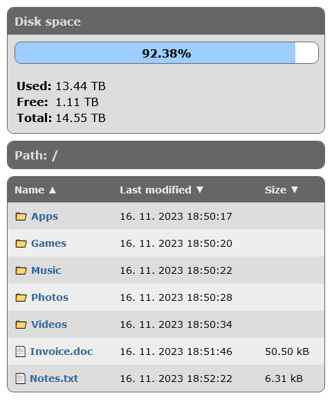

# Web File Browser

  

## Table of contents
- [**About**](#about)
- [**Features**](#features)
- [**Development state**](#development-state)
- [**Installation**](#installation)
- [**Screenshot**](#screenshot)
- [**License**](#license)
- [**Contribution**](#contribution)
- [**Donations**](#donations)
- [**Star history**](#star-history)

## About

**Web File Browser** is the tiny web application that helps you to browse and download your files you have stored on your web server. It is written in:

- **Backend**: [**Bun**](https://bun.sh/)
- **Frontend**: [**HTML**](https://www.w3.org/html/) + [**CSS**](https://www.w3.org/Style/CSS/) + [**JavaScript**](https://www.ecma-international.org/publications-and-standards/standards/ecma-262/)

## Features

- Very small code size
- File sorting
- Disk usage
- Responsive mobile design

## Development state

- Fully working version with minor bugs (please read [**TODO.md**](./TODO.md) document).

## Installation

- For installation instructions follow the [**INSTALL.md**](./INSTALL.md) document.

## Screenshot

 

## License

This software is developed as open source under [**Unlicense**](./LICENSE).

## Contribution

If you are interested in contributing to the development of this project, we would love to hear from you! Developers can reach out to us through one of the contact methods listed on [**our contacts page**](https://libersoft.org/contacts). We prefer communication through our Telegram chat group, but feel free to use any method that suits you.
In addition to direct communication, you are welcome to contribute by submitting issues or pull requests on our project repository. Your insights and contributions are valuable to us. We look forward to collaborating with you!

## Donations

Donations are important to support the ongoing development and maintenance of our open source projects. Your contributions help us cover costs and support our team in improving our software. We appreciate any support you can offer.

To find out how to donate our projects, please navigate here:

Thank you for being a part of our projects' success!

## Star history

